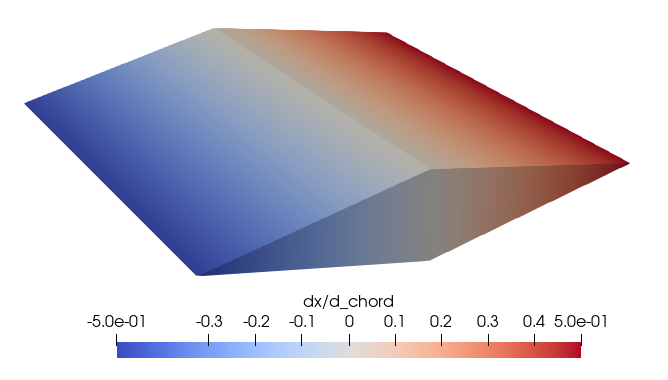
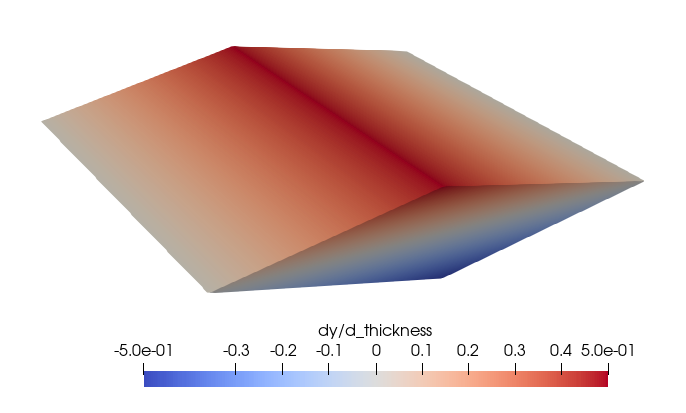

# Generating Parameter Sensitvities


## Workflow

### Nominal Geometry

First create the nominal geometry. 


### Parametric Geometry Generator

To run a sensitivity study, you need to create a class object which can output a hypervehicle.Vehicle instance, ready for generation. This means that all components need to be added to the Vehicle object returned. 

The class constructor will save all design parameters as class attributes. The **kwargs argument in the constructor method is used to pass in the design parameters which will be varied.

The class only needs one method, named ‘create_instance’. This method must return the ready-to-generate Vehicle instance, parameterised from the class attributes provided. 

The code below provides an example of this class. Note how the named kwargs are unpacked and overwrite the default parameters.

```python
class ParametricX43:
	def __init__(self, all_default_params = 1, **kwargs):
		self.default_params = all_default_params
		
		# Unpack kwargs
		for item in kwargs:
			setattr(self, item, kwargs[item])

	def create_instance(self):
		x43 = Vehicle()
		...
		# Add any components for the parametric vehicle
		...
		return x43
```

Note that the nominal (default) geometry could be created using the code above as follows.

```python
parametric_x43 = ParametricX43()
x43 = parametric_x43.create_instance()
x43.generate()
```

Make sure to rename the nominal geometry, as running the sensitivity study will overwrite it with new files. This will likely be fixed later on.


### Sensitivity Study

Now create the sensitivity study from hypervehicle.utils *SensitivityStudy* object, isntantiating it from the ParametricX43 
class created above. Then, define the design parameters which you 
would like to get sensitivities to. In this example, we are 
extracting the geometric sensitivities to the body_width parameter. 
Finally, run the study by calling the *dGdP* method, passing in 
the design parameters.

Note that the parameters dictionary values are for the nominal vehicle. 
This will act as a baseline, which will be perturbed to calculate
the sensitivities using finite differencing.

```python
from hypervehicle.utils import SensitivityStudy

ss = SensitivityStudy(ParametricX43)

# Define parameters to get sensitivities to
parameters = {'body_width': 1}

# Perform study
sensitivities = ss.dGdP(parameters)
```

The output of dGdP is a dictionary, containing pandas DataFrames for 
each component of the Vehicle object. For the example above of a single
component, this will be a dict with a single key ‘wing’, and value of 
a list with each wing component. Since there is just one wing component,
the list will have one element. 

This will create a unique file for each (component, parameter) pair.


### Visualisation

The .csv files can be opened in ParaView. After opening the file, 
select Table to Points (set x, y and z columns before applying), 
then Delaunay 3D filter.





