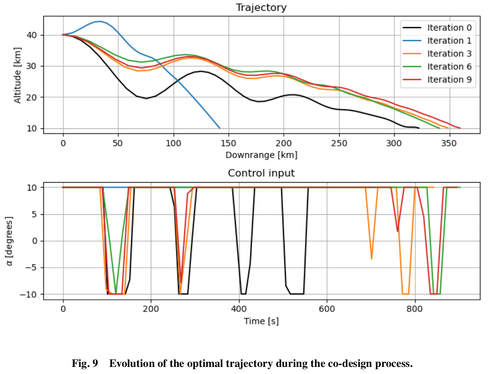

# 2024 Publications

## Efficient and Flexible Methodology for the Aerodynamic Shape Optimization of Hypersonic Vehicle Concepts in a High-Dimensional Design Space
*Presented at [AIAA SciTech Forum and Exposition 2024](https://arc.aiaa.org/doi/abs/10.2514/6.2024-2838)*

Aerodynamic shape of optimization of hypersonic vehicles parameterized by a large number
of design variables (e.g. more than 10) is challenging due to the high computational cost of
CFD evaluations. Gradient-based optimization methods are commonly used for this reason,
along with the adjoint method applied to the governing equations of the flow to provide the
optimizer with a search direction. Downsides of this approach include that it requires specialized
CFD solvers, highly converged CFD simulations, and it can still be costly when optimizing
against multiple performance objectives. Exploration studies in a high-dimensional design
space are particularly beneficial during the conceptual design phases, and thus an optimization
approach that is easy to implement, flexible, and quick to run is essential. In this paper, we
develop an alternative approach to obtain the search direction for gradient-based aerodynamic
shape optimization. The proposed approach is efficient, scalable, and CFD solver-agnostic.
An approximate Jacobian is obtained by applying lower order aerodynamic models (such as
Piston theory or Van Dyke’s second order theory) locally, thus allowing pressure sensitivities to
design parameters to be calculated without the need for further costly CFD simulations. The
accuracy of this approach is demonstrated by estimating pressure sensitivities for a canonical
shape, and the results are verified by comparison to finite difference of CFD solutions. We then
demonstrate the approach as a suitable means for shape optimization by optimizing a generic
hypersonic waverider for maximum Lift-to-Drag ratio (𝐿/𝐷), whilst also respecting an internal
volume constraint. Using an 8 CPU workstation, the optimized configuration (parameterized by
16 design variables) is obtained in little over 4 hours, with a 33% increase in 𝐿/𝐷.

## Developing a Co-Design Framework for Hypersonic Vehicle Aerodynamics and Trajectory
*Presented at [AIAA SciTech Forum and Exposition 2024](https://arc.aiaa.org/doi/10.2514/6.2024-0238)*

The extreme conditions at which hypersonic vehicles are required to operate necessitate a
novel method of design, capable of producing vehicles that can perform across their entire mission
trajectory. Traditional methods of design using trade studies of design parameters are incapable
of capturing complex and non-linear subsystem interactions, which dominate hypersonic flight
vehicles. Further challenges arise from the many competing design requirements, including
packaging constraints, aerodynamic requirements, and flight path objectives. While traditional
multi-objective design optimization methods attempt to address these challenges, they fail to
account for the entirety of a mission’s flight trajectory, and how the design parameters impact the
objective at a system-level. This paper presents a novel and computationally tractable approach
to co-design a vehicle’s geometry and flight trajectory simultaneously, in order to obtain an
optimal vehicle shape and flight path for a specified mission objective. That is, the vehicle
shape is and trajectory are optimized in the same phase to obtain a the highest performing
system solution in regards mission-level objectives. Importantly, the computational cost of
the proposed method scales favourably with the number of vehicle design parameters, and is
designed to reduce the number of computational fluid dynamic simulations. The approach
is demonstrated by optimizing a hypersonic glider (waverider) parametrically defined using
16 variables to attain maximum range while also obeying an internal volume constraint. The
optimal vehicle configuration obtained through the proposed co-designed framework exhibits
an 11.6 % improvement over the nominal configuration.

